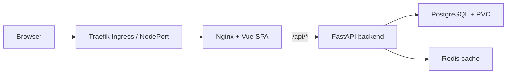

# DSAA 4040 E1 - Cloud-Native Online Bookstore

Course project for **DSAA 4040 Cloud Computing & Big Data Systems**.

This repository contains an engineering-track E1 implementation: a small online bookstore deployed as a cloud-native application on Kubernetes.

## What Is Implemented

| Layer | Technology | Status |
| --- | --- | --- |
| Frontend | Vue 3 + Vite + Nginx | Implemented |
| Backend | FastAPI + SQLAlchemy + Uvicorn | Implemented |
| Database | PostgreSQL 16 | Implemented with PVC in Kubernetes |
| Cache | Redis 7 | Implemented |
| Local run | Docker Compose | Verified |
| Kubernetes run | K3s + Traefik | Verified |
| Scaling | HPA for frontend and backend | Configured and metrics verified |

Core user workflow:

- Browse/search/filter books.
- Open book details.
- Add books to cart.
- Place an order.
- View order history.
- Check backend health through `/api/health`.

## Architecture



Kubernetes resources are under `bookstore/k8s/`:

- `Deployment` and `Service` for frontend, backend, PostgreSQL, and Redis.
- `ConfigMap` for runtime host/port configuration.
- `Secret` for database credentials.
- `PersistentVolumeClaim` for PostgreSQL data.
- `Ingress` for `/` and `/api` routing.
- `HorizontalPodAutoscaler` for frontend and backend.
- Readiness/liveness probes and resource requests/limits.

## Quick Run

### Docker Compose

```bash
cd bookstore
docker compose up -d --build
```

Verified local endpoints:

- Frontend: `http://localhost:18080`
- Backend health: `http://localhost:18000/api/health`

### Kubernetes

The final validation used a single-node K3s cluster with Traefik enabled. Minikube or Docker Desktop Kubernetes can also be used if the local environment already has them working.

```bash
cd bookstore
docker build -t bookstore-backend:latest ./backend
docker build -t bookstore-frontend:latest ./frontend

kubectl apply -f k8s/namespace.yaml
kubectl apply -f k8s/configmap.yaml
kubectl apply -f k8s/secret.yaml
kubectl apply -f k8s/postgres-pvc.yaml
kubectl apply -f k8s/postgres-deployment.yaml
kubectl apply -f k8s/redis-deployment.yaml
kubectl wait --for=condition=ready pod -l app=postgres -n bookstore --timeout=180s
kubectl wait --for=condition=ready pod -l app=redis -n bookstore --timeout=120s

kubectl apply -f k8s/backend-deployment.yaml
kubectl apply -f k8s/frontend-deployment.yaml
kubectl apply -f k8s/ingress.yaml
kubectl apply -f k8s/hpa.yaml
kubectl get all,ingress,hpa -n bookstore -o wide
```

Verified K3s endpoints from the final run:

- NodePort frontend/API: `http://localhost:30080`
- Traefik Ingress: `http://localhost:18081`

## Verification Evidence

Evidence is kept under `deliverables/evidence/`.

| Evidence | File |
| --- | --- |
| Compose API end-to-end flow | `deliverables/evidence/compose/compose_api_e2e.txt` |
| K8s API end-to-end flow | `deliverables/evidence/k8s/k8s_api_e2e_corrected.txt` |
| K8s objects, Ingress, HPA | `deliverables/evidence/k8s/bookstore_all_ingress_hpa.txt` |
| HPA metrics resolved | `deliverables/evidence/k8s/bookstore_hpa.txt` |
| Pod recovery and PVC persistence | `deliverables/evidence/k8s/k8s_recovery_persistence_final.txt` |
| Clean UI screenshots | `deliverables/evidence/screenshots/` |
| Demo video | `deliverables/video/final_demo.mp4` |

Validation summary:

- Docker Compose health and order workflow passed.
- K3s node and system Pods were ready.
- Frontend and backend both ran with 2 replicas.
- Traefik Ingress routed `/api` to `backend-service:8000`.
- HPA reported CPU targets from metrics-server.
- Deleting frontend/backend Pods recovered through Deployments.
- Restarting PostgreSQL preserved order data through PVC.

## Known Limitations

- PostgreSQL is a single Pod with local persistent storage. It survives Pod restart, but it is not a highly available database setup.
- PostgreSQL restart caused a short transient API failure before recovery; this is documented in the recovery evidence.
- HPA is configured and receives metrics, but the repository does not include a long sustained load-test report.
- Secrets are Kubernetes `Secret` objects for course demonstration, not integrated with an external secret manager.

## Main Files

```text
bookstore/
  backend/                 FastAPI application and Dockerfile
  frontend/                Vue SPA, Nginx config, Dockerfile
  k8s/                     Kubernetes manifests
  docker-compose.yaml      Local four-service deployment
  deploy.sh                Basic Kubernetes deployment script

deliverables/
  evidence/                Command outputs and UI screenshots
  video/final_demo.mp4     Edited demo walkthrough
```

## AI Usage Disclosure

AI tools were used for debugging, Kubernetes troubleshooting, documentation polishing, and generating local report/video artifacts. The submitted implementation and evidence were verified against the local Docker/K3s environment.
