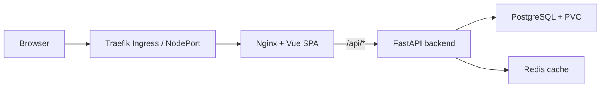

# DSAA 4040 E1 - Cloud-Native Online Bookstore

Course project for **DSAA 4040 Cloud Computing & Big Data Systems**.

This repository contains an engineering-track E1 implementation: a small online bookstore deployed as a cloud-native application on Kubernetes.

## What Is Implemented

| Layer | Technology | Status |
| --- | --- | --- |
| Frontend | Vue 3 + Vite + Nginx | Implemented |
| Backend | FastAPI + SQLAlchemy + Uvicorn | Implemented |
| Database | PostgreSQL 16 | Implemented with PVC in Kubernetes |
| Cache | Redis 7 | Implemented |
| Local run | Docker Compose | Verified |
| Kubernetes run | K3s + Traefik | Verified |
| Scaling | HPA for frontend and backend | Verified with controlled CPU load |

Core user workflow:

- Browse/search/filter books.
- Open book details.
- Add books to cart.
- Place an order.
- View order history.
- Check backend health through `/api/health`.

## Architecture



Kubernetes resources are under `bookstore/k8s/`:

- `Deployment` and `Service` for frontend, backend, PostgreSQL, and Redis.
- `ConfigMap` for runtime host/port configuration.
- `Secret` for database credentials.
- `PersistentVolumeClaim` for PostgreSQL data.
- `Ingress` for `/` and `/api` routing.
- `HorizontalPodAutoscaler` for frontend and backend.
- Readiness/liveness probes and resource requests/limits.

## Quick Run

### Docker Compose

```bash
cd bookstore
docker compose up -d --build
```

Verified local endpoints:

- Frontend: `http://localhost:18080`
- Backend health: `http://localhost:18000/api/health`

### Kubernetes

The final validation used a single-node K3s cluster with Traefik enabled. Minikube or Docker Desktop Kubernetes can also be used if the local environment already has them working.

```bash
cd bookstore

# Auto-detect Minikube, K3s-in-Docker, or a generic kubectl cluster.
./deploy.sh

# Explicit options used during final verification:
TARGET=k3s-docker ./deploy.sh
TARGET=minikube ./deploy.sh
```

Verified K3s endpoints from the final run:

- NodePort frontend/API: `http://localhost:30080`
- Traefik Ingress: `http://localhost:18081`

## Submission Artifacts

| Artifact | File |
| --- | --- |
| Final report | `deliverables/report/final_report.pdf` |
| Progress presentation slides | `bookstore/presentation/progress_presentation_en.pptx` |
| Final demo video with burned-in subtitles | `deliverables/video/DSAA4040_E1_bookstore_demo_subtitled.mp4` |
| Supporting experiment summary | `deliverables/evidence/hpa/hpa_result_summary.md` |
| Supporting PostgreSQL exports | `deliverables/evidence/db/` |
| Supporting Redis check | `deliverables/evidence/k8s/redis_cache_evidence.txt` |
| Supporting figures | `deliverables/evidence/visualizations/` |

Validation summary:

- Docker Compose health and order workflow passed.
- K3s node and system Pods were ready.
- Frontend and backend both ran with 2 replicas.
- Traefik Ingress routed `/api` to `backend-service:8000`.
- metrics-server was running and HPA reported live CPU targets.
- Controlled HPA load test scaled backend replicas from 2 to 8 under CPU pressure.
- Redis cache was verified with `catalog:*` keys after catalog API requests.
- Deleting frontend/backend Pods recovered through Deployments.
- Restarting PostgreSQL preserved order data through PVC.

## Experiment Scripts

```bash
cd bookstore

# End-to-end API workflow through the Kubernetes entrypoint.
BASE_URL=http://localhost:30080 ./scripts/smoke_test.sh

# HPA experiment. The final run used K3s-in-Docker:
KUBECTL='docker exec dsaa4040-k3s-server kubectl' \
  DURATION_SECONDS=240 WORKERS=14 ITERATIONS=6000000 \
  OUT_DIR=../deliverables/evidence/hpa \
  ./scripts/hpa_load_test.sh
```

## Known Limitations

- PostgreSQL is a single Pod with local persistent storage. It survives Pod restart, but it is not a highly available database setup.
- PostgreSQL restart caused a short transient API failure before recovery; this is documented in the recovery evidence.
- HPA load testing uses a diagnostics CPU endpoint to create controlled autoscaling pressure; it is not real user browsing traffic.
- Secrets are Kubernetes `Secret` objects for course demonstration, not integrated with an external secret manager.

## Main Files

```text
bookstore/
  backend/                 FastAPI application and Dockerfile
  frontend/                Vue SPA, Nginx config, Dockerfile
  k8s/                     Kubernetes manifests
  presentation/            Progress presentation PPTX
  scripts/                 Smoke test and HPA load-test scripts
  docker-compose.yaml      Local four-service deployment
  deploy.sh                Minikube/K3s/Kubectl deployment script

deliverables/
  report/final_report.pdf  Final project report
  evidence/                Small set of final experiment summaries and figures
  video/DSAA4040_E1_bookstore_demo_subtitled.mp4 final demo video
```

## Tool Usage Disclosure

Tools were used to assist debugging and documentation polishing. The system design, implementation choices, Kubernetes validation, experiments, and final verification were completed and reviewed by the team.
